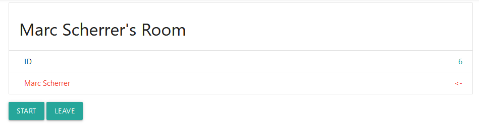

# 4 Gewinnt

_by [Marc Scherrer](mailto:marc.scherrer@hsr.ch)_

## Anleitung

### Login

Als erstes wählen Sie einen **Nickname** und eine **Farbe**, welche die Farbe der **Steine** bestimmt die Sie spielen. Die Farbe können Sie auch noch im Nachhinein ändern.

### Spielraum öffnen

Um einen **Spielraum** zu öffnen clicken Sie "New Room". Danach geben Sie einen **Namen** für den Raum ein und wählen Sie aus wieviele Spieler teilnehmen können. Die Teilnehmeranzahl muss mindestens 2 sein.

Sie werden automatisch den Raum betreten. Falls in einem Raum keine Teilnehmer hat, wird er automatisch gelöscht. 

Jetzt können andere Spieler den Raum sehen und teilnehmen.

Falls Sie jetzt sehen dass 2 Spieler dieselbe Farbe haben, können Sie diese noch ändern.

Um einen Raum zu verlassen drücken Sie "Leave".

### Spiel spielen

Um das Spiel zu starten clicken Sie auf "Start". Der erste Spieler kann nun den ersten Stein spielen.

Die Steine werden von oben nach unten in den jeweiligen Spalten aufgefüllt.

Die Steine werden abwechselnd von den Spielern nach [4 gewinnt Regeln](https://de.wikipedia.org/wiki/Vier_gewinnt#Regeln) gespielt.

Der Spieler welcher als erstes 4 Steine aneinander hat (vertikal, horizontal oder schräg) gewinnt.

Um nochmals zu spielen drücken Sie "Restart".

Falls Sie sich unsicher sind wem welcher Sein gehört fahren Sie mit dem Mauszeiger darüber.

### Zu beachten

* Falls ein Spieler an der Reihe ist, den raum aber verlässt, kann das Spiel nicht weiter gespielt werden.

* Wenn ein Spieler wärend dem Spiel die Farbe ändert behalten schon gespielte Steine die alte Farbe, neue Steine nehmen aber die neue an. Gewonnen wird aber immernoch mit den Steinen des Spielers.

* Die maximale Spieleranzahl muss nicht erreicht werden um ein Spiel zu starten.
* Ein Raum in dem **10 Minuten** nichts gemacht wird wird bei der nächsten Aktion (betreten, verlassen, spielen) automatisch gelöscht.
* Neue Räume und neue Spieler werden allen Benutzern über kleine Popups angezeigt.

* Die Applikation ist auf englisch umgesetzt, weil mir das einfacher fällt.

## Übersetzungen

| Englisch          | Deutsch              |
| ----------------- | -------------------- |
| Nickname          | Spitzname            |
| Submit            | Absenden             |
| New Room          | Neuer Raum           |
| Logout            | Ausloggen            |
| max. Player Count | maximale Spielerzahl |
| Create Room       | Raum erstellen       |
| Leave             | Verlassen            |
| [Name]'s Turn     | [Name] ist am Zug    |
| [Name] has won!   | [Name] hat gewonnen! |
| Enter Room        | Raum betreten        |

